# Architecture

AutoEval separates reusable execution infrastructure from each agent system's domain logic. The backend composes registries and services once; an agent package contributes definitions, handlers, seed data, and optional scoring. The frontend follows the same rule: routes select a feature screen, while the feature owns its forms and state.

## Reproducibility contract

Every run resolves four inputs before execution:

1. agent system version
2. prompt version
3. inference model
4. request or finalized dataset item

The trace stores those resolved IDs. A later version cannot change an existing trace or evaluation result.

## Data flow

```mermaid
flowchart LR
  Request[Request or dataset item] --> Resolve[Resolve exact versions]
  Resolve --> Graph[Compile LangGraph definition]
  Graph --> Node[Run traced nodes]
  Node --> Provider[Inference provider adapter]
  Node --> Deterministic[Deterministic node registry]
  Provider --> Spans[Trace spans]
  Deterministic --> Spans
  Spans --> Trace[End-to-end trace]
  Trace --> Review[Human review]
  Review --> Draft[Draft dataset version]
  Draft --> Final[Finalize immutable version]
  Final --> Eval[Multi-model evaluation]
  Eval --> Metrics[Quality, cost, latency]
```



## Version rules

- `AgentSystemVersion` stores a validated graph definition and SHA-256 content hash.
- `PromptVersion` stores the exact system prompt and SHA-256 content hash.
- `DatasetVersion` is mutable only while its status is `draft`.
- Finalizing a dataset version is one-way. Further edits require a new draft version.
- Evaluation runs accept only final dataset versions.

## Backend ownership

```text
autoeval_api/
  main.py                   ASGI export only
  app.py                    application composition, injection, lifespan
  api/
    dependencies.py         request-scoped dependencies
    middleware.py           request limits and security headers
    routes/                 one router per API domain
  agent_systems/
    incident_triage/        built-in example definition and domain logic
  graph/                    generic topology, node registry, runner
  inference/                provider contract, adapters, registry
  services/                 domain workflows, queries, serialization, scoring
  models.py                 persistence records
  schemas.py                public request and response contracts
```

Routes validate HTTP input and translate domain errors. Services own domain queries and workflows. The graph runner owns orchestration and span capture. Agent-system packages own domain-specific definitions and behavior. `app.py` is the composition root for replacing those dependencies without teaching routes about concrete providers or handlers.

## Implemented extension points

- `inference/base.py` defines the provider contract. `InferenceProviderRegistry.register` adds an adapter without changing the runner.
- `graph/registry.py` registers deterministic and LLM-output handlers. The runner resolves handlers by the stable names stored in a graph version.
- `services/scoring.py` owns metric suites and their registry. Evaluation orchestration asks the registry for a suite instead of importing incident-triage metrics.
- `agent_systems/incident_triage/` demonstrates how one system groups its definition, handlers, scoring, and seed data.

There is currently no `DatasetImporter`, `ArtifactStore`, or `EvaluationDispatcher` interface. Dataset edits use the dataset service, payloads are stored as JSON in SQLite, and evaluation background work runs in the FastAPI process. Introduce a real interface only when adding a second implementation.

## Frontend ownership

```text
frontend/src/
  app/                 route shells and global layout
  components/          shared shell, modal, status, and state UI
  features/
    catalog/            catalog projections
    traces/             trace list, run flow, DAG, inspector, review flow
    datasets/           draft editing and finalization
    evaluations/        model selection, launch, and polling
    results/            tables, row projection, and cost/accuracy chart
    systems/            graph and prompt version editors
  lib/                 API client, DTOs, formatting, shared data hook, CSP
```

Keep domain behavior in its feature directory. Promote a component to `components/` only after it is genuinely shared. `lib/api.ts` and `lib/types.ts` are the frontend boundary for backend contract changes.

## Selection and output behavior

- A request or evaluation may omit graph and prompt version IDs. Today that resolves the globally latest graph version and globally latest prompt version; it does not scope the lookup to an agent-system key.
- `output_node` must name a node in the graph definition. The runner currently expects the completed graph state to contain a top-level `output` key; otherwise the complete state becomes the trace output.
- All sink nodes connect to LangGraph `END`. `output_node` does not currently choose one sink when a graph branches.

## Local MVP boundaries

- SQLite and the in-process evaluation task are suitable for local, single-process use only.
- There is no authentication or authorization. Keep both servers on loopback.
- Trace retention is intentionally complete: requests, prompts, intermediate state, outputs, and errors persist without redaction or expiry.
- Provider secrets live only in the backend environment. CLI providers are disabled by default and cross a high-trust local execution boundary when enabled.
- Inputs and outputs persist as JSON. Providers may accept referenced multimodal input objects, but binary artifact storage and generated image, audio, or video outputs are future work.

See [extension-guide.md](extension-guide.md) for concrete edit paths and [code-security-review.md](code-security-review.md) plus [dependency-security-report.md](dependency-security-report.md) for the preserved before-fix security baseline.

## Initial agent system

The seeded incident-triage graph normalizes an incident report, asks an LLM for structured classification, applies deterministic routing policy, and drafts an operator response. Ground truth contains severity, route, and human-review requirement. This produces interpretable classification metrics without pretending that free-form text has a single objectively correct answer.
