# Architecture

AutoEval separates reusable execution infrastructure from each agent system's domain logic. The backend composes registries and services once; an agent package contributes one plugin manifest plus definitions, handlers, seed data, optional scoring, and an optional trace policy. The frontend follows the same rule: routes select a feature screen, while the feature owns its forms and state.

Each run compiles only the selected graph definition into its own LangGraph instance. Handler names are resolved through a system-scoped registry, so two growing systems may use the same local handler name without collision. AutoEval never constructs one global LangGraph containing nodes from every registered system.

## Reproducibility contract

Every run resolves five inputs before execution:

1. owning agent system
2. agent system version
3. same-system prompt version
4. inference model
5. request or finalized same-system dataset item

The trace stores those resolved IDs. A later version cannot change an existing trace or evaluation result.

## Data flow

```mermaid
flowchart LR
  Request[Request or dataset item] --> Resolve[Resolve exact versions]
  Resolve --> Graph[Compile LangGraph definition]
  Graph --> Node[Run traced nodes]
  Node --> Provider[Inference provider adapter]
  Node --> Deterministic[Deterministic node registry]
  Provider --> Spans[Trace spans]
  Deterministic --> Spans
  Spans --> Trace[End-to-end trace]
  Trace --> Review[Human review]
  Review --> Draft[Draft dataset version]
  Draft --> Final[Finalize immutable version]
  Final --> Eval[Multi-model evaluation]
  Eval --> Metrics[Quality, cost, latency]
```



## Version rules

- `AgentSystemVersion` stores a validated graph definition and SHA-256 content hash.
- `PromptVersion` stores the exact system prompt and SHA-256 content hash.
- `DatasetVersion` is mutable only while its status is `draft`.
- Finalizing a dataset version is one-way. Further edits require a new draft version.
- Evaluation runs accept only final dataset versions.
- Prompts and datasets belong to one agent system; cross-system selections are rejected.
- Trace execution origin and trace-to-dataset membership are independent provenance facts.

## Backend ownership

```text
autoeval_api/
  main.py                   ASGI export only
  app.py                    application composition, injection, lifespan
  api/
    dependencies.py         request-scoped dependencies
    middleware.py           request limits and security headers
    routes/                 one router per API domain
  agent_systems/
    registry.py             plugin composition and code-level UX metadata
    incident_triage/        built-in incident example
    portfolio_analyst/      synthetic portfolio analyst and deterministic math
    portfolio_query/        supplied-snapshot questions and covered-call screening
    seed.py                 built-in seed composition
  graph/                    generic topology, node registry, runner
  inference/                provider contract, adapters, registry
  services/                 domain workflows, queries, serialization, scoring
  models.py                 persistence records
  migrations.py             additive upgrade path for the original SQLite schema
  schemas.py                public request and response contracts
```

Routes validate HTTP input and translate domain errors. Services own domain queries and workflows. The graph runner owns orchestration and span capture. Agent-system packages own domain-specific definitions and behavior. `app.py` is the composition root for replacing those dependencies without teaching routes about concrete providers or handlers.

## Implemented extension points

- `inference/base.py` defines the provider contract. `InferenceProviderRegistry.register` adds an adapter without changing the runner. OpenRouter model capabilities live in the typed, deterministic `inference/model_catalog.py` rather than being fetched at process startup.
- LLM span output records allowlisted inference metadata, including OpenRouter's returned resolved model ID and request ID, alongside requested model provenance on the parent trace.
- `graph/registry.py` registers deterministic and LLM-output handlers under `(system_key, handler_name)`. The runner resolves handlers through the selected system scope.
- `services/scoring.py` composes metric suites contributed by system plugins. Evaluation orchestration asks the registry for a suite instead of importing a concrete system.
- `agent_systems/registry.py::builtin_system_plugins` is the single built-in composition root. Each package exports `plugin.py` and keeps its definition, handlers, scoring, seed data, and trace projection local.
- The shared graph state has only `input`, a mergeable system-owned `data` envelope, and `output`; adding a system does not require adding domain fields to a global state type.

There is currently no `DatasetImporter`, `ArtifactStore`, or `EvaluationDispatcher` interface. Dataset edits use the dataset service, payloads are stored as JSON in SQLite, and evaluation background work runs in the FastAPI process. Introduce a real interface only when adding a second implementation.

`AgentSystemSpec` is deliberately code-level. It supplies default models, an input template, editor identity, and the primary metric without trying to turn every agent UX into a database-driven form builder. Unknown registered systems receive generic JSON fallbacks.

## Frontend ownership

```text
frontend/src/
  app/                 route shells and global layout
  components/          shared shell, modal, status, and state UI
  features/
    catalog/            catalog projections
    traces/             trace list, run flow, DAG, inspector, review flow
    datasets/           draft editing and finalization
    evaluations/        model selection, launch, and polling
    run/                one-off pinned inference and latest trace result
    results/            tables, row projection, and cost/accuracy chart
    systems/            graph and prompt version editors
  lib/                 API client, DTOs, formatting, shared data hook, CSP
```

Keep domain behavior in its feature directory. Promote a component to `components/` only after it is genuinely shared. `lib/api.ts` and `lib/types.ts` are the frontend boundary for backend contract changes.

## Selection and output behavior

- A request or evaluation may omit graph and prompt version IDs. Resolution is always scoped to the selected system; omitting the system retains Incident Triage as the compatibility default.
- `output_node` must name a node in the graph definition. The runner currently expects the completed graph state to contain a top-level `output` key; otherwise the complete state becomes the trace output.
- All sink nodes connect to LangGraph `END`. `output_node` does not currently choose one sink when a graph branches.

## Local MVP boundaries

- SQLite and the in-process evaluation task are suitable for local, single-process use only.
- There is no authentication or authorization. Keep both servers on loopback.
- Trace capture and outbound inference are policy-aware. Portfolio systems remove identity-like fields, exact shares, and raw dollar values from persisted requests, span snapshots, and model context while deterministic calculations execute against the original in-memory request.
- Provider secrets live only in the backend environment. CLI providers are disabled by default and cross a high-trust local execution boundary when enabled.
- Inputs and outputs persist as JSON. Providers may accept referenced multimodal input objects, but binary artifact storage and generated image, audio, or video outputs are future work.

See [extension-guide.md](extension-guide.md) for concrete edit paths and [code-security-review.md](code-security-review.md) plus [dependency-security-report.md](dependency-security-report.md) for the preserved before-fix security baseline.

## Built-in agent systems

The seeded incident-triage graph normalizes an incident report, asks an LLM for structured classification, applies deterministic routing policy, and drafts an operator response. Ground truth contains severity, route, and human-review requirement. This produces interpretable classification metrics without pretending that free-form text has a single objectively correct answer.

The seeded portfolio analyst normalizes supplied profile and weighted holding context, identifies missing inputs, calculates allocation, concentration, bucket ranges, liquidity, and user-supplied scenarios deterministically, asks a model to explain those facts, and applies a deterministic financial-safety gate. Its fixtures are synthetic and its evaluation checks arithmetic invariants rather than treating prose as objective truth.

The seeded portfolio Q&A graph consumes a supplied snapshot document and verifies its content hash. For covered-call questions, deterministic handlers validate call type, standard contract multiplier, quote freshness, lot-level share coverage and restrictions, DTE, delta, liquidity, spread, event timing, assignment constraints, premium math, and ranking. Duplicate-symbol lots are aggregated without allowing an ineligible sleeve to overwrite an eligible one. The model receives only an allowlisted computed candidate summary and cannot create or alter candidates. The graph reports that market data is required instead of inventing a chain. Durable snapshot lookup by ID remains part of the flow migration rather than being implied by an unverified identifier.

Portfolio Analyst and Portfolio Q&A are separate runnable LangGraphs. They are temporarily represented as separate systems because the current persistent version aggregate owns one graph. The target multi-flow ownership model and migration are specified in [agent-flow-refactor-plan.md](agent-flow-refactor-plan.md).
