# Architecture

AutoEval separates reusable execution infrastructure from each agent system's domain logic. The backend composes registries and services once; an agent package contributes one plugin manifest plus definitions, handlers, seed data, optional scoring, and an optional trace policy. The frontend follows the same rule: routes select a feature screen, while the feature owns its forms and state.

Each run compiles only the selected graph definition into its own LangGraph instance. Handler names are resolved through a system-scoped registry, so two growing systems may use the same local handler name without collision. AutoEval never constructs one global LangGraph containing nodes from every registered system.

## Reproducibility contract

Every run resolves five inputs before execution. A product may expose multiple flow registrations,
but one run still selects exactly one graph:

1. owning agent system
2. agent system version
3. same-system prompt version
4. inference model
5. request or finalized same-system dataset item

The trace stores those resolved IDs. A later version cannot change an existing trace or evaluation result.

## Data flow

```mermaid
flowchart LR
  Request[Request or dataset item] --> Resolve[Resolve exact versions]
  Resolve --> Graph[Compile LangGraph definition]
  Graph --> Node[Run traced nodes]
  Node --> Provider[Inference provider adapter]
  Node --> Deterministic[Deterministic node registry]
  Provider --> Spans[Trace spans]
  Deterministic --> Spans
  Spans --> Trace[End-to-end trace]
  Trace --> Review[Human review]
  Review --> Draft[Draft dataset version]
  Draft --> Final[Finalize immutable version]
  Final --> Eval[Multi-model evaluation]
  Eval --> Metrics[Quality, cost, latency]
```



## Version rules

- `AgentSystemVersion` stores a validated graph definition and SHA-256 content hash.
- `PromptVersion` stores the exact system prompt and SHA-256 content hash.
- `DatasetVersion` is mutable only while its status is `draft`.
- Finalizing a dataset version is one-way. Further edits require a new draft version.
- Evaluation runs accept only final dataset versions.
- Prompts and datasets belong to one agent system; cross-system selections are rejected.
- Trace execution origin and trace-to-dataset membership are independent provenance facts.

## Backend ownership

```text
autoeval_api/
  main.py                   ASGI export only
  app.py                    application composition, injection, lifespan
  api/
    dependencies.py         request-scoped dependencies
    middleware.py           request limits and security headers
    routes/                 one router per API domain
  agent_systems/
    registry.py             plugin composition and code-level UX metadata
    incident_triage/        built-in incident example
    portfolio_analyst/      synthetic portfolio analyst and deterministic math
    portfolio_query/        supplied-snapshot questions and covered-call screening
    seed.py                 built-in seed composition
  codebase/                 configured-root Git snapshots and semantic graph projection
  graph/                    generic topology, node registry, runner
  inference/                provider contract, adapters, registry
  market_data/              registered runtime capabilities and Tradier options adapter
  services/                 domain workflows, queries, serialization, scoring
  models.py                 persistence records
  migrations.py             additive upgrade path for the original SQLite schema
  schemas.py                public request and response contracts
```

Routes validate HTTP input and translate domain errors. Services own domain queries and workflows. The graph runner owns orchestration and span capture. Agent-system packages own domain-specific definitions and behavior. `app.py` is the composition root for replacing those dependencies without teaching routes about concrete providers or handlers.

## Implemented extension points

- `inference/base.py` defines the provider contract. `InferenceProviderRegistry.register` adds an adapter without changing the runner. OpenRouter model capabilities live in the typed, deterministic `inference/model_catalog.py` rather than being fetched at process startup.
- LLM span output records allowlisted inference metadata, including OpenRouter's returned resolved model ID and request ID, alongside requested model provenance on the parent trace.
- `graph/registry.py` registers deterministic and LLM-output handlers under `(system_key, handler_name)`. The runner resolves handlers through the selected system scope.
- `services/scoring.py` composes metric suites contributed by system plugins. Evaluation orchestration asks the registry for a suite instead of importing a concrete system.
- `agent_systems/registry.py::builtin_system_plugins` is the single built-in composition root. Each package exports `plugin.py` and keeps its definition, handlers, scoring, seed data, and trace projection local.
- The shared graph state has only `input`, a mergeable system-owned `data` envelope, and `output`; adding a system does not require adding domain fields to a global state type.
- Request-scoped `GraphRuntimeContext` carries repositories and local resources that must not enter graph state. Portfolio Query uses it to resolve a full snapshot locally, then an explicit deterministic node constructs the provider-safe model context.
- A node may declare a registered, schema-versioned `runtime_input_policy` capability with separate direct-runtime and evaluation modes. The runner resolves direct Portfolio Q&A to `refresh` and evaluations to `locked`; locked mode resolves an immutable snapshot selected separately from business input and cannot call a provider. Policies may be conditionally required, so generic portfolio questions skip the options observation while covered-call questions fail closed if it is absent. The observation is runtime provenance, not graph or prompt version content.

There is currently no `DatasetImporter`, `ArtifactStore`, or `EvaluationDispatcher` interface. Dataset edits use the dataset service, payloads are stored as JSON in SQLite, and evaluation background work runs in the FastAPI process. Introduce a real interface only when adding a second implementation.

`AgentSystemSpec` is deliberately code-level. It supplies default models, an input template, editor identity, and the primary metric without trying to turn every agent UX into a database-driven form builder. Unknown registered systems receive generic JSON fallbacks.

## Codebase map boundary

The codebase map is intentionally independent of agent-system persistence. `CodebaseGraphService` reads a single configured Git repository and constructs exact before/after snapshots. A file adapter derives areas, modules, files, symbols, and imports. A separate logic adapter validates `.codemap/logic.json` and projects changed files onto agent-maintained systems, domains, capabilities, components, and explicit architectural relations. Both return the same transport-neutral graph contract.

The viewer is deterministic and never invokes a coding agent. Architectural judgment stays versioned in the inspected repository. `$maintain-codebase-logic` teaches a coding agent to create or refresh the manifest from runtime flows, product behavior, source ownership, tests, and docs. When a historical snapshot lacks a manifest, the current worktree model is used as a projection lens for that Git diff.

Comparison sources have explicit meanings:

- `current`: working-tree structure with no change overlay
- `working`: `HEAD` to the tracked and untracked working tree
- `staged`: `HEAD` to the Git index
- `commit`: first parent to the selected commit
- `pr`: merge base to PR head, resolved through GitHub CLI and local Git objects

The frontend reveals four levels but renders only the branch under the current focus. When a threshold is crossed, it anchors the closest node under the pointer or viewport center, recalculates a scoped layout, and animates the viewport so that node retains its screen coordinate. Hysteresis prevents threshold flicker; newly revealed children use a short opacity and blur transition.

The browser can select a mode and comparison but cannot select a filesystem path. `AUTOEVAL_CODEBASE_ROOT` is resolved on the server at startup, symlinks that leave the root are skipped, Git subprocesses use argument arrays without a shell, and commit/PR selectors are validated. This keeps the current local-only boundary reusable when the map becomes its own app.

## Frontend ownership

```text
frontend/src/
  app/                 route shells and global layout
  components/          shared shell, modal, status, and state UI
  features/
    catalog/            catalog projections
    traces/             trace list, run flow, DAG, inspector, review flow
    datasets/           draft editing and finalization
    evaluations/        model selection, launch, and polling
    run/                one-off pinned inference and latest trace result
    results/            tables, row projection, and cost/accuracy chart
    systems/            graph and prompt version editors
    codebase/           semantic zoom, Git comparison controls, map, and inspector
  lib/                 API client, DTOs, formatting, shared data hook, CSP
```

Keep domain behavior in its feature directory. Promote a component to `components/` only after it is genuinely shared. `lib/api.ts` and `lib/types.ts` are the frontend boundary for backend contract changes.

## Selection and output behavior

- A request or evaluation may omit graph and prompt version IDs. Resolution is always scoped to the selected system; omitting the system retains Incident Triage as the compatibility default.
- `output_node` must name a node in the graph definition. The runner currently expects the completed graph state to contain a top-level `output` key; otherwise the complete state becomes the trace output.
- All sink nodes connect to LangGraph `END`. `output_node` does not currently choose one sink when a graph branches.

## Local MVP boundaries

- SQLite and the in-process evaluation task are suitable for local, single-process use only.
- There is no authentication or authorization. Keep both servers on loopback.
- Trace capture and outbound inference are separate policy boundaries. Non-synthetic portfolio traces remove identity-like fields, exact shares, symbols, and raw dollar values; provider calls receive only an explicit typed model context. Synthetic fixtures may retain richer local trace output for evaluation and inspection.
- Provider secrets live only in the backend environment. CLI providers are disabled by default and cross a high-trust local execution boundary when enabled.
- Inputs and outputs persist as JSON. Providers may accept referenced multimodal input objects, but binary artifact storage and generated image, audio, or video outputs are future work.

See [extension-guide.md](extension-guide.md) for concrete edit paths and [code-security-review.md](code-security-review.md) plus [dependency-security-report.md](dependency-security-report.md) for the preserved before-fix security baseline.

## Built-in agent systems

The seeded incident-triage graph normalizes an incident report, asks an LLM for structured classification, applies deterministic routing policy, and drafts an operator response. Ground truth contains severity, route, and human-review requirement. This produces interpretable classification metrics without pretending that free-form text has a single objectively correct answer.

The Portfolio Analyst index flow normalizes supplied profile and holding context, identifies missing inputs, calculates allocation, concentration, bucket ranges, liquidity, and user-supplied scenarios deterministically, asks a model to explain those facts, applies a deterministic financial-safety gate, and persists an immutable snapshot outside LangGraph state. Its fixtures are synthetic and its evaluation checks arithmetic invariants rather than treating prose as objective truth.

The Portfolio Analyst query flow accepts a question plus a generic node-resource selection outside business input. Its `get_indexed_portfolio` policy pins the product, producer system/node, output key, snapshot kind, and schema. A normal run may select `current` by stable portfolio identity; the server resolves that to an exact snapshot and the trace stores the canonical locked selection. Dataset items and evaluations accept only locked selections, and the runner revalidates producer, node, output, kind, schema, and content hash before replay. The full portfolio stays in request-scoped runtime context and never enters query graph state.

A separate deterministic node either resolves a pinned immutable options observation or refreshes the registered options-chain capability. Direct refresh defaults to no artifact capture; `capture_node_outputs=true` persists the normalized observation when the run may become an evaluation fixture. Both paths record bounded execution metadata, but a trace with an uncaptured used live observation cannot be promoted to a dataset. The initial live adapter uses Tradier with explicit timeout/size limits and records source, mode, provider name, as-of/fetch time, quote delay/freshness, separate Greeks provenance, and contract count. Vendor references and full chains remain request-local. Tradier sandbox data is 15 minutes delayed with no Greeks; production brokerage quotes are real-time and Greeks are hourly. For covered-call questions, deterministic handlers validate call type, standard contract multiplier, quote freshness, lot-level share coverage and restrictions, DTE, delta availability/range, liquidity, spread, event timing, assignment constraints, premium math, and ranking. Unknown earnings timing fails closed when the blackout is enabled. Duplicate-symbol lots are aggregated without allowing an ineligible sleeve to overwrite an eligible one. The model receives the bounded question plus typed, allowlisted facts, safe market provenance, and aliased candidates; provider contract symbols never enter inference or persisted traces.

Portfolio Analyst is one logical product with separate `index` and `query` flow manifests. The catalog and Run UI expose that relationship while the current compatibility storage keeps independent runtime keys and graph-version histories. The normalized persistent multi-flow model is specified in [agent-flow-refactor-plan.md](agent-flow-refactor-plan.md). The two graphs are never merged.
# Snapshot architecture

Snapshot-enabled deterministic nodes publish immutable outputs into a shared
`node_output_snapshots` catalog. Portfolio state, retrieved documents, market observations, and future
node outputs use one discovery/API/UI contract while retaining typed schemas and optional domain
storage. `snapshot_policy` on the graph node makes capture intent versioned and inspectable.

Snapshot content/capture provenance is immutable. A separate trace-span usage records whether that
execution produced or consumed the artifact, whether it was live/replayed/resolved/computed, and its
latency, status, cost, tokens, and node-specific execution metadata. This separation allows one
artifact to be replayed by N evaluations without corrupting artifact history.
